class: inverse, center, middle

# Data

## Tests scores of ENEM 

### National Exam for High School students in Brazil

---

# Data information

Data available online about exam students take to enter universities.

1. There are more than 7 million observations in the data.

1. We consider around 20.000 observations from the state of SP.

1. Variables available:

- Scores for different disciplines;

- Gender;

- Income and education the parents;

---

# 3D scatterplot

.center[]

- y1: Score in natural sciences, such as Chemistry, Physics and Biology.

- y2: Score in human sciences, such as History, Geography, Philosophy and
Sociology.

- y3: Score in Mathematics.

---

# Directions

.center[]

- 512 directions considered

---
class: inverse, center, middle

# Results

---

# Effect of Private vs Public School

.left-column[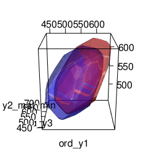]

.center-column[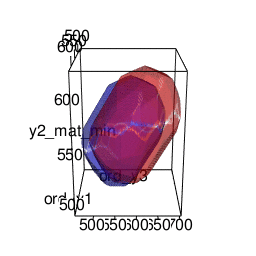]

.right-column[]

---

# Effect of Men vs Women

.left-column[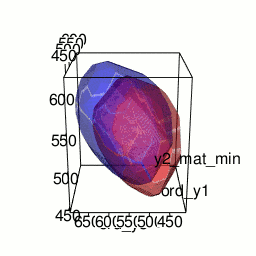]

.center-column[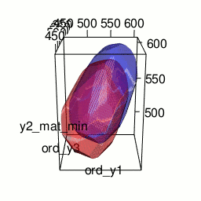]

.right-column[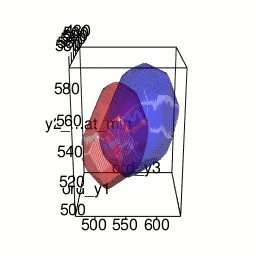]

---

# Effect of Father education

.left-column[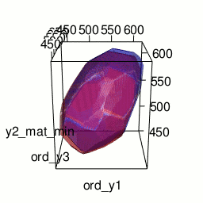]

.center-column[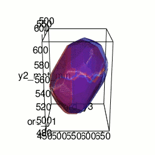]

.right-column[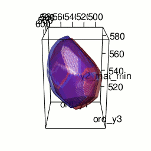]

---

# Effect of Mother education

.left-column[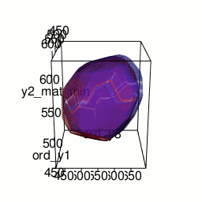]

.center-column[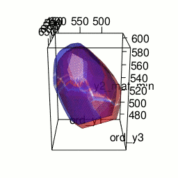]

.right-column[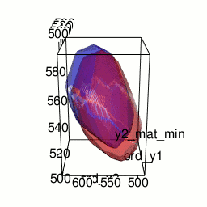]

---

# Effect of parents with higher income

.left-column[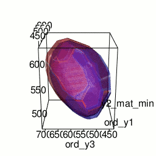]

.center-column[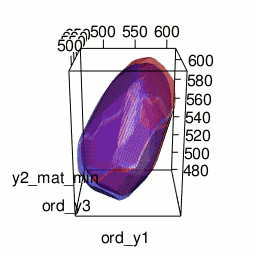]

.right-column[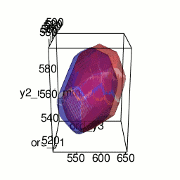]
