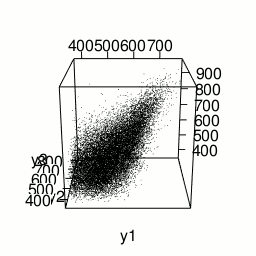
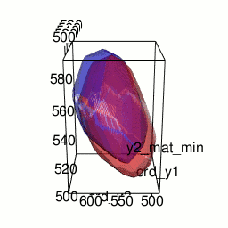
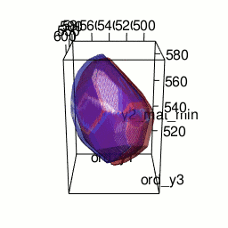
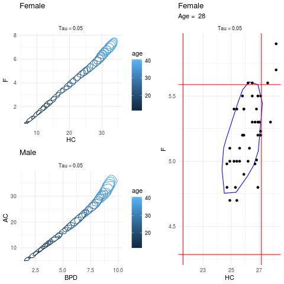

layout: true 

background-image: url(img/daslab.png)
background-position: 0% 100%
background-size: 20%

---
class: middle

# Modelos de regressão quantílica para variáveis resposta multidimensionais

*****

### Bruno Santos

<!-- ### Departamento de Estatística -->

---
class: center, middle

# Notas no ENEM


### O que podemos aprender com esses dados?

---

# 3D gráfico de dispersão

.center[]

- y1: Nota em ciências naturais.

- y2: Nota em ciências humanas.

- y3: Nota em matemática.
 

---

# Perguntas

- Quais as diferenças entre as notas de pessoas de escolas privadas e escolas públicas?

--

- Se a mãe tem educação superior, existe diferença nas notas das pessoas?

--

- E com relação ao pai? 

--

# Uma possível análise:

- **STA13824: Análise de regressão!**

--

  - Disciplina do 5º período;
  - Estuda as propriedades das médias condicionais;
  - Considera inicialmente que a variável resposta tem distribuição Normal
  
--

- **STA13830: Modelos lineares generalizados!**


---

# Variável resposta multidimensional

.center[]

--

- É preciso definir direções e bases ortonormais em espaços de diferentes dimensões
  - **MAT13682: Geometria analítica**
  - **MAT13695: Álgebra linear**

---

# Modelos de regressão quantílica

- Não é necessário assumir uma distribuição de probabilidade!

--

- Porém, é importante verificar a consistência dos estimadores:

--

  - Inferência clássica:
      - **STA13820: Inferência Estatística I**
      - **STA13823: Inferência Estatística II**
--
  
  - Inferência Bayesiana:
      - **STA13826: Inferência Bayesiana**
      - **STA13816: Probabilidade I**
      - **STA13819: Probabilidade II**
    
    
---

# Considerando inferência bayesiana

- Pode envolver desenvolvimento de pacotes computacionais

```{r, eval=FALSE}
library(devtools)
install_github('brsantos/baquantreg')
```

--

- **INF05116:	Programação**

- **STA13817: Estatística Computacional I**

- **STA13818: Estatística Computacional II**


---

# Respostas

```{r eval=FALSE}
baquantreg:::drawQuantileRegion_3D(...)
```


- Sobre a diferença entre escolas públicas e privadas

.center[]

---

# Mais respostas

- Sobre a diferença entre a educação dos pais:
  - qual das figuras se refere ao caso em que a mãe tem educação superior?
  
--
  
.pull-left[

]

.pull-right[

]

---

# E quando consideramos mais dimensões?

- Trabalho conjunto com a Prof. Agatha:

- Medidas de ultrasonografias de bebês:

  - 4 medidas diferentes do feto
  - Curvas de crescimento em função das semanas de gestação
  
.center[]


---

# Possibilidades no projeto

- Aprendizado de novas técnicas estatísticas:
  - regressão quantílica;
  - regressão não linear;
  - preditores aditivos estruturados;
  - ...

--

- Desenvolvimento de rotinas computacionais no R:
  - visualização de resultados para mais de 3 dimensões;
  - códigos para avaliação do ajuste do modelo;
  - ...
  
--

- Trabalho em novas aplicações
  - DATASUS;
  - POF;
  - Dados ambientais: poluição, ventos, ...