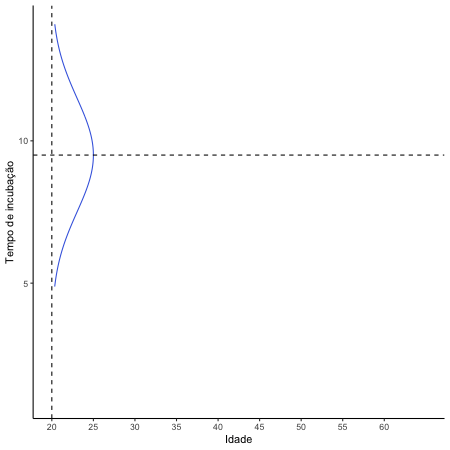
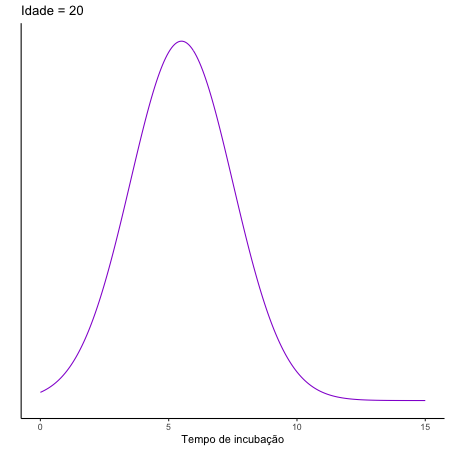

layout: true

background-image: url(ukent_logo.jpg)
background-position: 95% 5%
background-size: 20%

---
class: middle, center

# Modelos de regressão: 
# Novas perspectivas além da média condicional

*****

### Bruno Santos


#### email: b.santos@kent.ac.uk


### Encontro Paraibano de Estatística

---

layout: false

```{r setup, include=FALSE}
options(htmltools.dir.version = FALSE)
library(dplyr)
library(ggplot2)
library(kableExtra)
library(patchwork)
library(glmnet)
library(dplyr)
library(ggplot2)
library(gganimate)
library(lubridate)
library(forcats)
library(leaflet)
library(rgdal)
knitr::opts_chunk$set(echo = TRUE, 
                      message = FALSE, 
                      warning = FALSE, 
                      fig.align = "center")
```

```{r xaringan-themer, include=FALSE, warning=FALSE}
library(xaringanthemer)
style_mono_accent(base_color = "#003882", 
                 header_font_google = google_font("Bebas Neue"),
                 text_font_google   = google_font("Montserrat", "300", "300i"),
                 code_font_google   = google_font("Fira Mono")
                 # header_font_google = google_font("Bebas Neue", "400", "400i")
                 )
```

```{r xaringan-scribble, echo=FALSE}
xaringanExtra::use_scribble()
xaringanExtra::use_share_again()
```

```{r xaringan-tachyons, echo=FALSE}
xaringanExtra::use_tachyons()
```

class: inverse, middle, center

# Introdução


---
# Modelos de regressão

- Modelo estatístico para quantificar associações entre duas ou mais variáveis.

--

- Em geral, consideramos 

  - Regressão à media ou Regressão da média
  
--

- Se definimos 

  - $Y$ como variável resposta;
  - $X$ como variável explicativa.
  
--

$$\begin{align*}
E(Y|X = x) &= f(x) \\
&= \beta_0 + \beta_1 x
\end{align*}$$

---

# Visualização - Efeito positivo

.center[

]


---
# Visualização - Efeito positivo

.center[

]

---

# Dist. condicionais - Efeito positivo

.center[
]


---

# Dist. condicionais - Efeito negativo

.center[
]


---
# Resumo

- Modelo linear

$$Y_i = \beta_0 + \beta_1 x_i + \epsilon_i, \quad i=1,\ldots,n.$$
--

- Suposições do modelo normal linear:

  - Homocedasticidade: $\mbox{Var}(\epsilon_i) = \sigma^2$.
  
  - Erros são independentes.
  
  - $\epsilon_i \sim N(0, \sigma^2)$.
  
--

- É possível então verificar se essas suposições são válidas depois que ajustamos o modelo.

  - Análise de diagnóstico.


---
# Exemplo - Dados

.center[

]

---
# Métodos de estimação

- Modelo linear 

$$Y_i = \beta_0 + \beta_1 x_i + \epsilon_i$$
--

- Mínimos quadrados ordinários 
$$\min_{(\beta_0, \beta_1) \in \mathbb{R}^2} \sum_{i=1}^n (Y_i - \beta_0 - \beta_1 x_i)^2$$

--

- Modelo linear em sua forma matricial

$$Y = X\beta + \epsilon$$
--

- Estimador de mínimos quadrados

$$\hat{\beta} = (X^t X)^{-1}X^t Y$$


---
# Exemplo - Regressão

.center[

]

---
# Uma visão sobre regressão

.bg-washed-green.b--dark-green.ba.bw2.br3.shadow-5.ph4.mt5[
O que a curva de regressão faz é dar um grande resumo das médias das distribuições correspondentes ao 
conjunto dos $x$'s observados. Nós poderíamos ir além e computar diversas curvas de regressão correspondendo
aos vários pontos percentuais da distribuição e dessa forma ter uma visão mais completa desse conjunto. 
Usualmente isso não é feito, e logo a regressão frequentemente dá uma visão mais incompleta. Assim como a média dá 
uma visão incompleta de uma única distribuição, também a curva de regressão dá uma visão incompleta correspondente
para um conjunto de distribuições.
.tr[
— Mosteller e Tukey (1977), pág. 266
]]

---
# Distribuição normal e seus quantis

.pull-left[
]

--

.pull-right[
]


---
# Regressão com quantis condicionais

.center[

]

---
class: inverse, bottom, left
background-image: url("img/gauss.jpg")
background-size: cover

### Túmulo do Gauss

---
class: center, middle, inverse

# Regressão quantílica


---

# Considerações iniciais

- O modelo de regressão normal linear é capaz de estimar quantis condicionais.

--

  - Porém, esses quantis são sempre paralelos.
  
--

- ### E quando esses quantis não são paralelos? 

--

- Esse é o interesse dos modelos de regressão quantílica. 

--

- Estimar o efeito de cada variável preditora para diferentes quantis.

--

- Esse comportamento vai violar a hipótese de homocedasticidade.

--

  - As suposições para estimação desse modelo vão ser diferentes.
  
--

- Exemplo:

  - Será que a diferença entre homens e mulheres é diferente para baixas e altas rendas?
  
---
# Visualização da diferença - Modelo normal linear

.center[

]

---
# Exemplo - Nature

.center[
]


---
# Sobre estimação

- No modelo linear 

$$Y_i = \beta_0 + \beta_1 x_i + \epsilon_i$$
--

- Consideramos minimizar os erros ao quadrado:

$$\min_{(\beta_0, \beta_1) \in \mathbb{R}^2} \sum_{i=1}^n (Y_i - \beta_0 - \beta_1 x_i)^2$$

--

- Por que não considerar os erros absolutos?

$$\min_{(\beta_0, \beta_1) \in \mathbb{R}^2} \sum_{i=1}^n |Y_i - \beta_0 - \beta_1 x_i |$$
--

- Historicamente, a proposta de minimizar os erros absolutos foi feita primeiro. 

--

  - Porém, não era possível com as ferramentas da época encontrar a solução do problema.
  
---

# Definição de quantis

- Seja $Y$ uma variável aleatória com função de distribuição acumulada 
$$
 F(y) = P(Y \leqslant y).
$$

- Utilizando a função inversa da distribuição acumulada no ponto $\tau$, define-se que 

$$F^{-1}(\tau) = \mbox{inf}\{y: F(y) \geqslant \tau \}$$

é o quantil de ordem $\tau$ da variável aleatória Y.


---
# Função de perda

- Lembre da função de perda quadrática $l(Y - \theta) = (Y - \theta)^2$.

--

  - Essa função é minimizada em média quando $\hat{\theta} = \bar{Y}$.
  
--

  - $\displaystyle \min_{\theta \in \Theta} E[(Y - \theta)^2]$.
  
--

- Considere uma outra função de perda
$$\rho_\tau (u) = u(\tau-\mathbb{I}(u<0)), \quad 0 < \tau < 1,$$
em que $\mathbb{I}$ é a função indicadora. 

--

- Seja $\hat{y}$, um previsor de $Y$, que minimiza a perda esperada 
$$E \big[ \rho_\tau(Y-\hat{y}) \big].$$
--

- Verifica-se que $\hat{y}=F^{-1}(\tau)$ minimiza essa perda esperada.

---
# Artigo seminal

.center[
]

---
# Principal resultado

- Koenker e Bassett (1978):

  - Obter o estimador da regressão quantílica $\boldsymbol \beta(\tau)$ como solução do problema de minimização
  
$$\displaystyle \min_{\boldsymbol{\beta} \in \mathbb{R}^p} \sum_{i=1}^n \rho_\tau(y_i - \boldsymbol{x_i}'\boldsymbol{\beta}).$$
--

- Esse estimador também pode ser chamado de estimador de mínimos absolutos ponderados.

--

- A obtenção dos valores de mínimos dessa função são obtidos através de algoritmos de programação linear:

  - Algoritmo simplex;
  - Algoritmo de ponto interior.
  
--

- No `R` pode ser utilizado o pacote `quantreg`.

---
# Exemplo - Gráfico com coeficientes

.center[]

---
# Exemplo - Gráfico com coeficientes

.center[]

---
# Abordagem bayesiana

- Notem que não foi necessário assumir uma distribuição de probabilidade para a variável resposta.

--

  - Essa é considerada uma das vantagens do método.
  
--

- Para a abordagem bayesiana, lembrem que é necessário uma função de verossimilhança.

--

- O Teorema de Bayes nos permite dizer

$$\pi(\beta|Y) \propto L(\beta) \pi(\beta)$$
--

- No caso dos modelos de regressão quantílica, vamos considerar a distribuição Laplace Assimétrica.

--

- $Y \sim LA(\mu, \sigma, \tau)$, com função densidade:

$$f(y;\mu,\sigma,\tau) = \frac{\tau(1-\tau)}{\sigma}\exp\left\{-\rho_\tau\left( \frac{y_i - \mu}{\sigma} \right)\right\}.$$
--

- Propriedade importante: $P(Y < \mu) = \tau$.


---
# Exemplos da densidade


.pull-left[

]

--

.pull-right[
]

---
# Detalhe sobre a verossimilhança

--

.center[
]

---
class: inverse, middle, center

# Exemplo com dados simulados

---
# Distribuição Beta

- $Y \in [0, 1]$.

--

- $Y \sim Beta(a, b)$, em que $a > 0$ e $b > 0$, se a função densidade é dada por

$$f(y | a, b) = \frac{\Gamma(a+b)}{\Gamma(a)\Gamma(b)} y^{a-1}(1-y)^{b-1}.$$

--

<br>

- Propriedades

  - $E(Y) = a/(a+b)$
  - $Var(Y) = (a+b)/[(a+b)^2(a+b+1)]$
  
--

<br>

- Exemplo:

  - Proporção de pessoas com acesso a internet
  - Proporção de clientes endividados que não pagam o total das dívidas
  
---

# Exemplo da função de densidade

```{r graf15, out.width='60%', fig.asp=.75, fig.align='center', message=FALSE, echo=FALSE}
numero_pontos <- 100
list_parametros <- list(c(1, 1), 
                        c(4, 2), 
                        c(2, 4), 
                        c(4, 4), 
                        c(10, 10))

densidade_beta <- lapply(list_parametros, 
                       function(x) dbeta(0:numero_pontos/numero_pontos, 
                                         x[1], x[2])) %>%
  unlist()

dados_beta <- data.frame(x = rep(0:numero_pontos/numero_pontos, 
                                 length(list_parametros)),
                              densidade = densidade_beta, 
                              parametros = rep(as.character(list_parametros), 
                                          each = numero_pontos + 1))


ggplot(dados_beta, aes(x = x, y = densidade, color = parametros)) +
  theme_minimal() + 
  geom_line() + 
  scale_color_discrete(name = "(a, b)")
```

---
# Reparametrização da densidade

- Podemos reparametrizar a densidade da distribuição:

  - **Objetivo:** Os parâmetros tenham uma interpretação mais interessante. 

$$f(y_i; \mu_i, \phi) = \frac{\Gamma(\phi)}{\Gamma(\mu_i \phi)\Gamma((1-\mu_i)\phi)} y^{\mu_i \phi-1}(1-y)^{(1-\mu_i)\phi-1}, \quad 0 < y_i < 1,$$
- $E(Y) = \mu$, $0 < \mu < 1.$
- $\mbox{Var}(Y) = (\mu(1-\mu))/(1+\phi)$, $\phi > 0.$

--

- Podemos também escrever os parâmetros como função de outras variáveis.

--

- Obtendo um modelo de regressão beta.

  - $g(\mu_i) = x_i^t\beta$
  

---
# Mistura de distribuições Beta

- Considere que geramos valores de uma distribuição $X \sim Unif(0, 1)$.

--

- Simulamos então 600 observações da distribuição Beta com $\phi = 100$ e considerando dois valores para $\mu_i$ com igual probabilidade

$$\mu_1 = \frac{\exp(-1-x_i)}{1 + \exp(-1-x_i)},$$ 
$$\mu_2 = \frac{\exp(1+x_i)}{1 + \exp(1+x_i)}.$$
--

- Isso vai gerar uma mistura de duas distribuições Beta.

  - Com mesmo parâmetro de precisão.
  
  - Porém, médias diferentes.
  
---
# Histograma dos dados

.center[
]

---
# Diagrama de dispersão

.center[
]

---
class: middle

# Coeficientes estimados pela regressão quantílica

.right-column[
]

.left-column[
<br><br><br>

- Os coeficientes são iguais a 1 para os maiores quantis.

- E iguais a -1 para os menores quantis.

- Sem a necessidade de definição da distribuição beta.
]

---
class: inverse, bottom, left
background-image: url("img/canterbury1.jpg")
background-size: cover

### Canterbury

---
class: middle, center, inverse

# Exemplo com dados reais


---
# Dados sobre renda na Paraíba

- Dados da PNAD 2015.

- Filtrando pessoas do Estado da Paraíba.

- Considerando somente pessoas que fazem parte da População Economicamente Ativa (PEA).

- Maiores de 18 anos.

- Com rendimentos maiores que 0.

--

- Total: 2.544 pessoas.

  - **Variável resposta**: rendimento das pessoas

---
# Histograma da renda segundo outras variáveis

.pull-left[
]

--

.pull-right[
]

---
# Gráfico de dispersão segundo outras variáveis

.pull-left[
]

--

.pull-right[
]

---
# Modelo de regressão quantílica

- Vamos considerar o seguinte modelo:

--

- **Variável resposta:** 

  - Rendimento.
  
--

- **Variáveis explicativas:**

  - Idade
  - Gênero (Feminino, Masculino)
  - Etnia (Branca, Não Branca)
  - Anos de Estudo
  
---
# Estimativas do modelo

.center[

]

---

# Estimativas do modelo - Anos de estudo

.center[

]


---

# Estimativas do modelo - Pessoas não brancas

.center[

]

---

# Estimativas do modelo - Genero Masculino

.center[

]

---

# Estimativas do modelo - Idade

.center[

]

---
# Comentários finais

- A regressão quantílica permite utilizar esses efeitos da regressão de forma local.

--

- Não é necessário supôr uma distribuição de probabilidade para os dados.

--

  - Vide exemplo com mistura de dados com distribuição beta.
  
--

- O modelo de regressão quantílica permite obter conclusões como:
  - uma variável tem efeito diferente de zero apenas para uma certa região da variável resposta. 

--

- É possível utilizar tanto a abordagem bayesiana quanto frequentista.

---
class: inverse, bottom, left
background-image: url("img/coffee_pexel.jpg")
background-size: cover

### Perguntas

---
class: inverse, middle, center

# Outros modelos de regressão

---
# Modelos de regressão

- Inicialmente, falamos de modelos de regressão para a média.

  - A média é descrita como função de outras covariáveis.
  
--

- O modelo normal é o principal exemplo dessa classe de modelos.

--

  - Mas podemos citar também modelos lineares generalizados (MLG).
  
--

- Em seguida, apresentamos modelos de regressão quantílica.

--

  - Mais flexíveis, pois são capazes de estimar efeitos nos diferentes quantis.
  
--

- Mas existem outras formas de sugerir modelos mais flexíveis.

---

# Regressão da distribuição

- Podemos considerar que todos os parâmetros disponíveis de uma distribuição de probabilidade podem receber termos de regressão.

--

  - O que isso significa?
  
--

- Considerem o caso em que $Y \sim Beta(\mu, \phi)$.

  - Podemos escrever um modelo para a média
  
--

$$g(\mu) = x^t \beta$$
--

  - Mas poderíamos escrever também um modelo para o parâmetro de precisão.
  
--

$$h(\phi) = z^t \gamma$$
--

- As variáveis preditoras podem ser as mesmas ou podemos considerar conjuntos diferentes.

--

- Alguns dos modelos que sugerem essa alternativa são conhecidos como *distributional regression*.

  - GAMLSS ou BAMLSS.

---
# BAMLSS

- *Bayesian additive models for location, scale and shape.* 

  - *A Lego Toolbox for Flexible Bayesian Regression (and Beyond)*

- Vocês podem encontrar uma boa introdução a esses modelos em 

  - [http://www.bamlss.org](http://www.bamlss.org)

--

- Esses modelos são equivalentes aos modelos GAMLSS, porém com abordagem bayesiana. 

--

- A ideia é que se

$$Y \sim \mathcal{D}(h_1(\theta_1), \ldots, h_k(\theta_k))$$
--

- Então, é possível utilizar esses modelos com

$$\eta_i = \eta(X, \beta_i) = f_{1j}(X;\beta_{1j}) + \cdots + f_{mj}(X;\beta_{mj})$$
--

- Em que essas funções podem representar efeitos não lineares, efeitos espaciais, etc.

---
# Exemplo 

- Vamos considerar os dados que utilizarmos anteriormente sobre renda no Estado da Paraíba.

--

- Podemos considerar a distribuição Gama para modelar esses dados. 

--

- A densidade da distribuição gama utilizada é dada por

$$f(y; \mu, \sigma) = \frac{y^{\sigma-1}\exp\left\{-\frac{\sigma y}{\mu}\right\}}{\left(\frac{\mu}{\sigma}\right)^\sigma \Gamma(\sigma)}$$

--

- No `R`, podemos fazer o seguinte:

```{r, echo = FALSE}
dados_pnad <- read.csv('dadosResumo_PNAD2015.csv', 
                       head = TRUE)

dados_paraiba <- dados_pnad %>% 
  filter(UF == 25) %>% 
  filter(CondicaoAtividade == 1) %>% 
  filter(Idade > 18) %>% 
  mutate(rendimento = ifelse(RendimentoTotal >= 9e11, NA, RendimentoTotal)) %>% 
  filter(!is.na(rendimento)) %>% 
  filter(rendimento > 0) %>% 
  mutate(etnia = ifelse(Etnia == 2, "Branca", "Não Branca")) %>% 
  mutate(genero = ifelse(Sexo == 2, "Masculino", "Feminino"))
```


```{r, results='hide'}
library(bamlss)

f <- rendimento ~ genero + etnia + Idade + AnosEstudo

b1 <- bamlss(f, family = "gamma", data = dados_paraiba)
```

--

- Inicialmente estamos modelando somente a média de $Y$.

---
# Primeiros resultados 

- Para obter as estimativas e respectivos intervalos de credibilidade, podemos fazer

```{r, eval = FALSE}
resumo_modelo <- summary(b1)
```

--

- Uma parte desse resultado pode ser vista na Tabela, com os coeficientes para a media


--

- Todas as variáveis aparecem contribuir para explicar a média da variável renda.

---
# Efeitos não lineares 

- Será que o efeito das variáveis idade e anos de estudo são lineares? 

--

- Podemos verificar essa hipótese testando a possibilidade de um efeito não-linear para cada uma dessas variáveis.

--

- Poderíamos começar testando um efeito polinomial para cada uma delas.

- Com o BAMLSS, podemos fazer isso alterando a nossa fórmula:

```{r, results='hide'}
f2 <- rendimento ~ genero + etnia + poly(Idade, 3) + poly(AnosEstudo, 3)

b2 <- bamlss(f2, family = "gamma", data = dados_paraiba)
```

- Podemos comparar os dois modelos, a partir do DIC.

```{r}
DIC(b1, b2)
```

---
# Visualização dos efeitos não lineares

- Podemos fazer o seguinte no R para visualizar os efeitos não lineares:

```{r, eval = FALSE}
nd <- data.frame(AnosEstudo = seq(1, 16, len = 100), 
                 Idade = seq(18, 80, len = 100))

nd$pIdade <- predict(b2, newdata = nd, 
                     model = "mu", term = "Idade",
        FUN = c95, intercept = FALSE)

nd$pAnosEstudo <- predict(b2, newdata = nd, 
                     model = "mu", term = "AnosEstudo",
                     FUN = c95, intercept = FALSE)

par(mfrow = c(1, 2))
ylim <- range(c(nd$pIdade, nd$pAnosEstudo))
plot2d(pIdade ~ Idade, data = nd, ylim = ylim)
plot2d(pAnosEstudo ~ AnosEstudo, data = nd, ylim = ylim)
```

---
# Resultado

.center[
]

---
class: inverse, bottom, left
background-image: url("img/dirichlet.jpg")
background-size: cover

### Túmulo do Dirichlet

---
# Outras distribuições de probabilidade

- Aqui, consideramos a distribuição Gama, mas poderíamos ter considerado outras.

--

  - Inclusive, não fizemos nenhum tipo de análise de diagnóstico.
  
--

- Antes de fazer isso, vamos propor modelos com outras distribuições de probabilidade.

  - E fazer essa comparação.
  
--

- Podemos tentar as seguintes distribuições de probabilidade.

  - Distribuição Weibull.
  - Distribuição Lognormal.
  - Distribuição de Pareto generalizada.
  
- Para quem quiser ver as densidades dessas distribuições de probabilidade, elas estão aqui:

  - [http://www.bamlss.org/articles/families.html](http://www.bamlss.org/articles/families.html)

---
# Ajustando os outros modelos

```{r, results='hide'}
b2_1 <- bamlss(f2, family = "gamma", data = dados_paraiba)

b2_2 <- bamlss(f2, family = "weibull", data = dados_paraiba)

b2_3 <- bamlss(f2, family = "lognormal", data = dados_paraiba)

b2_4 <- bamlss(f2, family = "gpareto", data = dados_paraiba)
```

--

- Podemos comparar os DIC's dos modelos

--

```{r}
DIC(b2_1, b2_2, b2_3, b2_4)
```


---
# Análise de diagnóstico

- O resíduo mais utilizado para esse tipo de modelo é o resíduo quantílico. 

  - Resumidamente, você espera que esse resíduo tenha distribuição normal, se o modelo está bem ajustado.
  
--

- Podemos usar os seguintes comandos no R para avaliar esse ajuste:

```{r, eval = FALSE}
plot(b2_1, which = c("hist-resid", "qq-resid"))

plot(b2_2, which = c("hist-resid", "qq-resid"))

plot(b2_3, which = c("hist-resid", "qq-resid"))

plot(b2_4, which = c("hist-resid", "qq-resid"))
```

---
# Diagnóstico - Modelo gama


---
# Diagnóstico - Modelo Weibull


---
# Diagnóstico - Modelo Lognormal


---
# Diagnóstico - Modelo Pareto Generalizado


---
# Agora o parâmetro $\sigma$

- Na distribuição gama, tínhamos 

$$f(y; \mu, \sigma) = \frac{y^{\sigma-1}\exp\left\{-\frac{\sigma y}{\mu}\right\}}{\left(\frac{\mu}{\sigma}\right)^\sigma \Gamma(\sigma)}$$
--

- Ajustamos um modelo para o parâmetro $\mu$.

  - Porém, podemos verificar se podemos ganhamos informação utilizando uma regressão para o parâmetro $\sigma$.
  
--

- Basicamente, vamos assumir uma estrutura de regressão para $\sigma.$

$$h(\sigma) = f(X; \gamma)$$
  
```{r, eval = FALSE}
f3 <- list(rendimento ~ genero + etnia + poly(Idade, 3) + poly(AnosEstudo, 3), 
           sigma ~ genero + etnia + poly(Idade, 3) + poly(AnosEstudo, 3))

b3 <- bamlss(f3, family = "gamma", data = dados_paraiba)
```

---

# Coeficientes para $\mu$ 

.center[]


---

# Coeficientes para $\sigma$

.center[]

---
# Visualização dos efeitos não lineares

- Podemos utilizar os mesmos comandos que foram utilizados anteriormente, somente alterando o comando `model = "sigma"`

```{r, eval = FALSE}
nd <- data.frame(AnosEstudo = seq(1, 16, len = 100), 
                 Idade = seq(18, 80, len = 100))

nd$pIdade <- predict(b2, newdata = nd, 
                     model = "sigma", term = "Idade",
        FUN = c95, intercept = FALSE)

nd$pAnosEstudo <- predict(b2, newdata = nd, 
                     model = "sigma", term = "AnosEstudo",
                     FUN = c95, intercept = FALSE)

par(mfrow = c(1, 2))
ylim <- range(c(nd$pIdade, nd$pAnosEstudo))
plot2d(pIdade ~ Idade, data = nd, ylim = ylim)
plot2d(pAnosEstudo ~ AnosEstudo, data = nd, ylim = ylim)
```

---
# Resultado

.center[]


---
# Aumentando a flexibilidade do efeito não linear

- Ao invés de usar um modelo polinomial, podemos utilizar uma abordagem mais flexível.

--

- Por exemplo, usando alguma forma de splines. 

--

  - O pacote BAMLSS tem algumas funções já pré-definidas.
  
--

- Para ajustar o modelo dessa forma, podemos fazer

```{r, eval = FALSE}
f4 <- list(rendimento ~ genero + etnia + Idade + s(AnosEstudo), 
           sigma ~ genero + etnia + s(Idade) + s(AnosEstudo))

b4 <- bamlss(f4, family = "gamma", data = dados_paraiba)
```

---
# Visualização do efeito não linear

.center[]

---
class: inverse, bottom, left
background-image: url("img/canterbury2.jpg")
background-size: cover

### Canterbury

---
# Interpretação dos parâmetros nesses modelos

- Podemos utilizar um pacote do R para nos ajudar a observar os resultados dos modelos.

--

- Um pacote que faz isso é o `distreg.vis`.

  - Mais informações em [https://github.com/Stan125/distreg.vis](https://github.com/Stan125/distreg.vis).
  
--

- Com ele, é possível gerar diferentes cenários para as variáveis explicativas e observar a distribuição de probabilidade associada.

--

- Após ajustar os modelos, podemos fazer o seguinte para fazer as comparações.

```{r, eval = FALSE}
distreg.vis::vis()
```

--

- Esse comando vai iniciar um aplicativo do Shiny para visualizar os resultados dos modelos.

---
# Ilustração do aplicativo

- Um exemplo dos gráficos que podemos obter com esse pacote.

.center[]

---
# Ilustração do aplicativo

- Também podemos comparar os valores dos momentos dos cenários escolhidos.

.center[]

---
class: inverse, middle, center

# Efeitos espaciais

---
# Intuição

- Existem diferentes formas de você estimar efeitos espaciais dentro de um modelo estatístico.

--

- Uma dessas formas é pensar em splines em duas dimensões. 
--

  - Agora, obteremos uma superfície não linear. 
  
--

- O pacote BAMLSS também possibilita diferentes formas de se estimar esse efeito espacial.

--

- Podemos ver alguns exemplos nas figuras a seguir.

---
# Exemplo com dados sobre chuva na Austria

- Retirado do artigo 

  - Umlauf, Klein and Zeileis (2018). “BAMLSS: Bayesian Additive Models for Location, Scale and Shape (and Beyond).” *Journal of Computational and Graphical Statistics* 27 (3): 612–27.
  
.center[]


---
# Resultados do modelo

.center[]

---
# Resultados do modelo

.pull-left[]

.pull-right[]

---
class: inverse, middle, center

# Modelos de regressão quantílica para variáveis aleatórias com mais de uma dimensão

---
# Variável resposta com mais de uma dimensão

.pull-left[
Escore no ENEM:
- $Y_1$: ciências humanas
- $Y_2$: ciências biológicas
- $Y_3$: matemática 

Nota-se uma relação de dependência entre as variáveis.

]

.pull-right[
]

---
# Direções

.center[]

- Nesse modelo, foram estimados modelos em 512 direções:

  - Para entender como diferentes variáveis podem ter um efeito na nota das pessoas fazendo o ENEM.
  
- Variáveis consideradas:

  - Gênero, escola pública vs privada, educação dos pais, etc.

---
# Diferença entre escola pública e privada

.center[]

---

class: middle, center, inverse

# Modelos de regressão quantílica com dados de sobrevivência

---
# Exemplo:

- Artigo: Rodrigues, Borges e Santos (2021). A defective cure rate quantile regression model for male breast cancer data. 

.center[]


---
class: middle, center


# Obrigado!
 
**b.santos@kent.ac.uk**

**Twitter:** @bruno_r_santos


