class: center, middle

background-image: url(figuras/virus.png)
background-size: cover

# Modelagem estatística em tempos de pandemia <br><br><br><br><br><br><br><br>

#### Bruno Santos | Webnário PPGMAT | 10 Jun 2020

---
class: top, center

# Estatística

--

.pull-left[#### Estatística Matemática
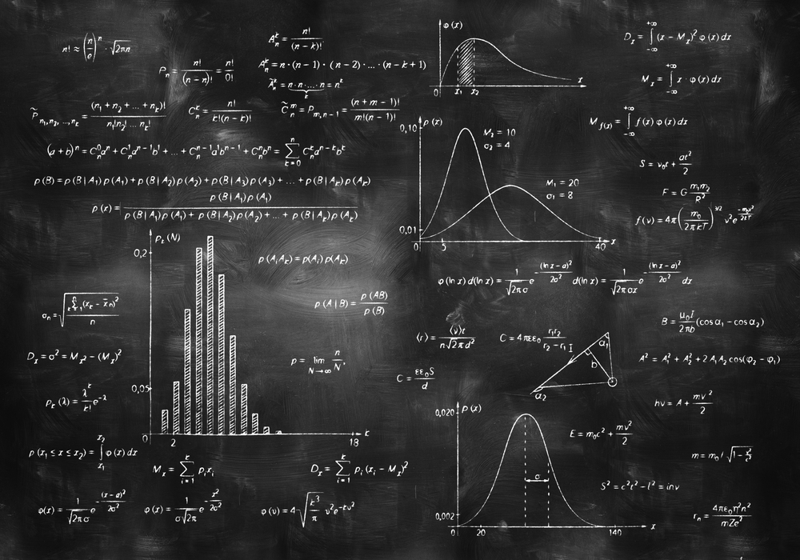
]


.pull-right[####Estatística Computacional/Aplicada

]

```{r setup, include=FALSE}
options(htmltools.dir.version = FALSE)
library(gganimate)
```

```{r xaringan-themer, include=FALSE, warning=FALSE}
library(xaringanthemer)
style_mono_light(
  base_color = "#23395b",
  header_font_google = google_font("Josefin Sans"),
  text_font_google   = google_font("Montserrat", "300", "300i"),
  code_font_google   = google_font("Fira Mono")
)
```


---
class: inverse, center, middle

# O que são modelos estatísticos?


---
class: top

# Fenômenos aleatórios...

.center[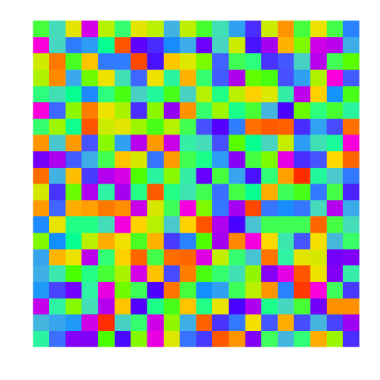]

---
class: top

# ... podem ocorrer em padrões

.center[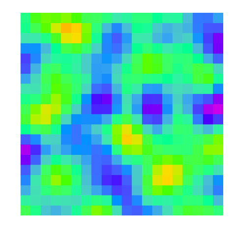]

---
class: top

## Como medir essa aleatoriedade?

* **PROBABILIDADE**: 
  * Medida de incerteza para qualquer **informação** desconhecida.

* Variáveis aleatórias

  * Número de pessoas infectadas em uma certa cidade.
  
  * Valor da renda das pessoas infectadas por uma doença.

.pull-left[.center[**Caso discreto**]
&nbsp;&nbsp;&nbsp;&nbsp;&nbsp;&nbsp;
&nbsp;&nbsp;&nbsp;&nbsp;&nbsp;&nbsp;&nbsp;&nbsp;
 
]

.pull-right[.center[**Caso contínuo**]
&nbsp;&nbsp;&nbsp;&nbsp;&nbsp;&nbsp;
&nbsp;&nbsp;&nbsp;&nbsp;&nbsp;&nbsp;&nbsp;&nbsp;
  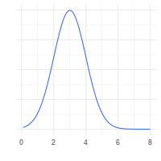
]

---
class: top

# Distribuições de probabilidade

* Caso contínuo, função de densidade $f(x)$:
  * $f(x) \geq 0, \forall x \in \mathbb{R}$, 
  * $\int_\mathbb{R} f(x)dx = 1$.

* Exemplo: distribuição normal 

--

$$f(x; \mu, \sigma^2) = \frac{1}{\sqrt{2\pi\sigma^2}}\exp\left\{-\frac{1}{2} \left(\frac{x-\mu}{\sigma}\right)^2 \right\}, \quad x \in \mathbb{R}$$
  * Parâmetros: $\theta = (\mu, \sigma^2), \mu \in \mathbb{R} \mbox{ e } \sigma^2 > 0$.
  
    * Média: $\int_\mathbb{R} x f(x)dx = \mu$
    * Variância: $\int_\mathbb{R} (x-\mu)^2 f(x)dx = \mu$

---
class: top

# Distribuição normal

* Uma das principais distribuições de probabilidade.

* É possível utilizar a distribuição normal para aproximar o cálculo de outras distribuições.

.pull-left[

]

.pull-right[
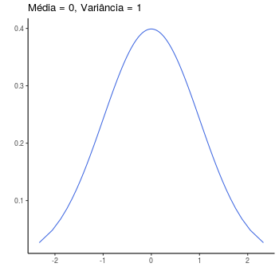
]

---
class: top

# Modelos de regressão

* Estudo de distribuições de probabilidade condicionais

* $X$: tempo de incubação do novo coronavirus:

  * como função do sexo da pessoa.

--


.center[
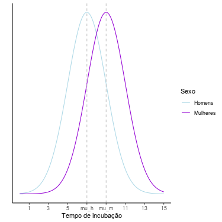
]

---
class: top

# Modelos de regressão

* Estudo de distribuições de probabilidade condicionais

* $Y$: tempo de incubação do novo coronavirus:

  * como função da idade da pessoa.

.pull-left[
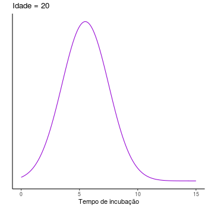
]

.pull-left[
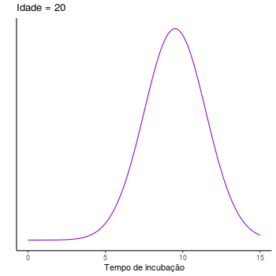
]

---

# Modelos de regressão

* Estudo de distribuições de probabilidade condicionais

* $Y$: tempo de incubação do novo coronavirus:

  * como função **linear** da idade da pessoa.

.pull-left[
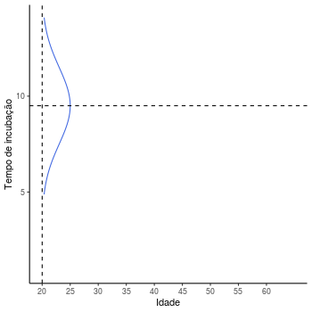
]

.pull-left[
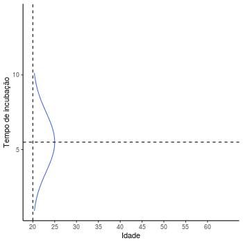
]

---

## Modelo linear geral de regressão

* $Y | X_1$: distribuição do tempo de incubação dada a idade.

--

* $Y|X_1 \sim N(\mu, \sigma^2)$

--

  * $\mu = \beta_0 + \beta_1 X_1$

--

* Descoberto por volta de 1800 

  * Adrien-Marie Legendre - 1805
  * Carl Friedrich Gauss - 1809 (ou 1795?)

.center[  
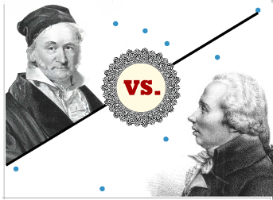  
]


---

## Modelo linear geral de regressão

* $Y | X_1, X_2$: distribuição do tempo de incubação dada a idade e sexo.

* $Y|X_1, X_2 \sim N(\mu, \sigma^2)$

  * $\mu = \beta_0 + \beta_1 X_1 + \beta_2 X_2$

--

* Poderíamos considerar k covariáveis e o seguinte modelo para a média

  * $\mu = \beta_0 + \beta_1 X_1 + \beta_2 X_2 + \cdots + \beta_p X_p$

--

* Podemos reescrever o modelo anterior matricialmente

  * $\mu = X \beta$, em que 
  
    * $X = [1 \quad X_1 \quad X_2 \,\,\, \cdots \,\,\, X_k ]$
    * $\beta = [\beta_0 \quad \beta_1 \quad  \beta_2 \,\,\, \cdots \,\,\, \beta_k ]'$


---

# Modelos lineares generalizados

* Nelder e Wedderburn (1972). _Generalized linear models_

* $Y$ pertence à família exponencial de distribuições

  * Normal
  * Gama
  * Binomial
  * ...

* $E(Y) = \mu$

  * $g(\mu) = X\beta$
  * Se $\mu \in [0, 1]$, $g(\mu) = \log\left(\frac{\mu}{1 - \mu}\right)$


---

# Modelos aditivos generalizados

* Hastie e Tibshirani (1990). _Generalized additive models_

* $E(Y) = \mu$

  * $g(\mu) = \beta_0 + f_1(X_1) + f_2(X_2) + \cdots + f_p(X_p)$
  
--
  
* Rigby e Stasinopoulos (2005). _Generalized additive models for location, scale and shape_ 

  * $\nu_1(\theta_1) = \beta_0 + f_1(X_1) + f_2(X_2) + \cdots + f_p(X_p)$
  * $\nu_2(\theta_2) = \gamma_0 + g_1(X_1) + g_2(X_2) + \cdots + g_p(X_p)$
  * $\nu_3(\theta_3) = \lambda_0 + h_1(X_1) + h_2(X_2) + \cdots + h_p(X_p)$


* Todos os parâmetros são escritos como função de variáveis preditoras:
  * podem ser considerados efeitos lineares também.

---
class: inverse, top, right
background-image: url("figuras/gauss.jpg")
background-size: contain

### Túmulo do Gauss


---
class: inverse, center, middle

# As diferentes abordagens na Estatística:

### Clássicos (`r emojifont::emoji('smile')`) vs Bayesianos (`r emojifont::emoji('heart_eyes')`)

---
class: top

# Função de verossimilhança

- Considere que temos uma amostra de tempos de incubação para $n$ pessoas. $Y_1 = 7,8; Y = 8,5; \cdots; Y_n = 10,1.$

.center[
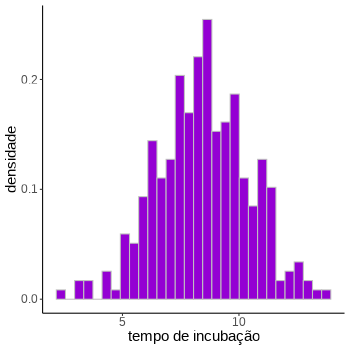
]

* Se $Y \sim N(\mu, \sigma)$ é verdadeira:

  * quais valores de $\mu$ e $\sigma^2$ devem ter gerado essa amostra?
  

---

# Função de verossimilhança

* Suponha $\sigma^2$ fixo conhecido nesse caso.

* $\theta = \mu$.

* Função densidade conjunta de $Y_1, \ldots, Y_n$.
  * $L(\theta) = f(y_1, y_2, \ldots, y_n | \theta)$ 

.center[

]

* O problema do método é falar sobre as incertezas acerca de estimativas de $\theta$.

---

# Teorema de Bayes

* Mecanismo probabilístico para atualizar suas crenças sobre qualquer valor desconhecido.

$$p(\theta | y) = \frac{f(y|\theta)}{f(y)} p(\theta)$$

--

Podemos reescrever o teorema como
$$p(\theta | y) \propto f(y|\theta) p(\theta)$$

--

Em que podemos colocar esse resultado como

$$\mbox{Dist a posteriori de } \theta \propto \mbox{Verossimilhança} \times \mbox{Dist a priori de }\theta$$

A inferência bayesiana permite falar sobre probabilidades associadas a $\theta$ depois que observamos os dados.


---

# Exemplo considerando diferentes priori's

.pull-left[
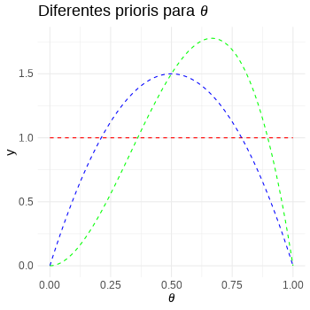
]

--

.pull-right[
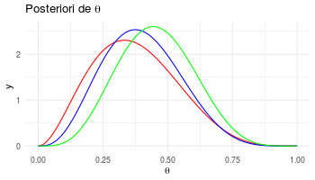
]


---

# Quando o tamanho da amostra aumenta

.pull-left[

]

--

.pull-right[
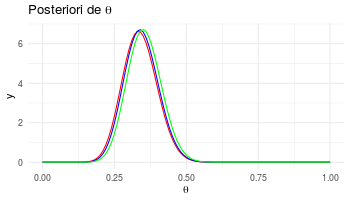
]

---
class: inverse, center, middle

# Um pouco da minha pesquisa

---
class: middle

# Regressão quantílica

* Consideremos outras medidas relacionadas a distribuição de $Y$

* Quantil:

  * $P(Y \geq Q_y) = \tau$
  * $\int_{-\infty}^{Q_y} f(x)dx = \tau$
  
.pull-left[
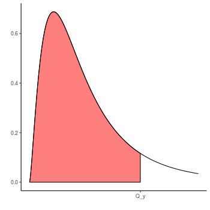
]

.pull-right[
<br><br>
$Q_y(\tau) = X \beta(\tau)$
]

---

# Pró e contras

.pull-left[.center[### Vantagens]

* Não há necessidade de assumir uma distribuição de probabilidade.

* É capaz de explicar também casos em que a variância é função de covariáveis.

* Permite obter conclusões locais sobre o problema em questão.
]

.pull-right[### Desvantagens

* Necessidade de algoritmos de programação linear.

* No caso bayesiano, é necessário utilizar uma distribuição auxiliar na verossimilhança.

* É necessário definir cada quantil de interesse.
]


---
class: center, middle

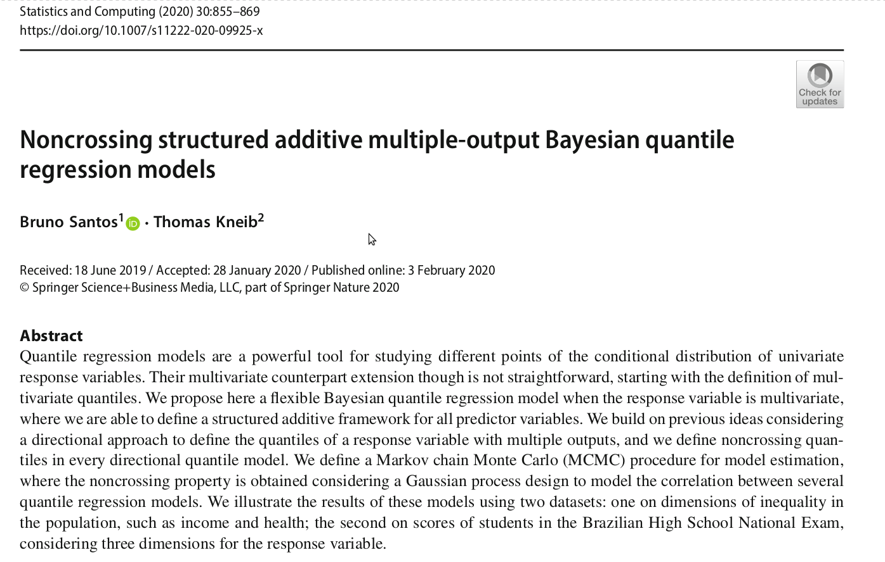


---

# Dados ENEM

.center[
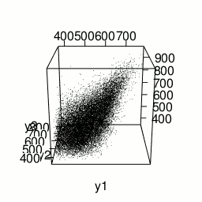
]

Variáveis:

* $y_1$: nota em ciências humanas;
* $y_2$: nota em ciências naturais;
* $y_3$: nota em matemática.


---
class: middle

# Direções de interesse

.center[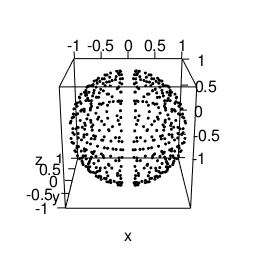]

* 512 directions consideradas na estimação do modelo

* Para cada direção, é construída uma base ortonormal:
  
  * obtenção de um quantil multivariado direcional
  
---

# Efeito de escolas privadas vs escolas públicas

.center[
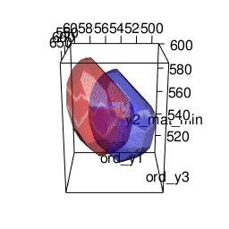

] 

* Há uma diferença grande nas disciplinas de Matemática e Ciências Naturais

* Essa diferença é menor nas Ciências Humanas, principalmente entre os alunos com pior rendimento.

---
class: inverse, bottom, left
background-image: url("figuras/dirichlet.jpg")
background-size: contain

### Túmulo do Dirichlet


---
class: inverse, center, middle

# Quando modelos estatísticos erram?

<br>

# Alguns modelos para a Covid-19

---
class: center

# Eleições americanas

.pull-left[<br>
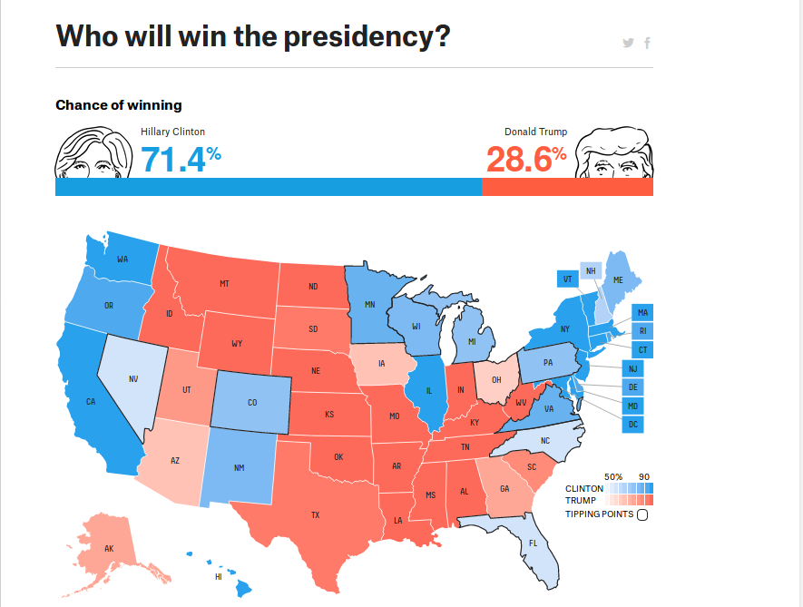
]

.pull-right[
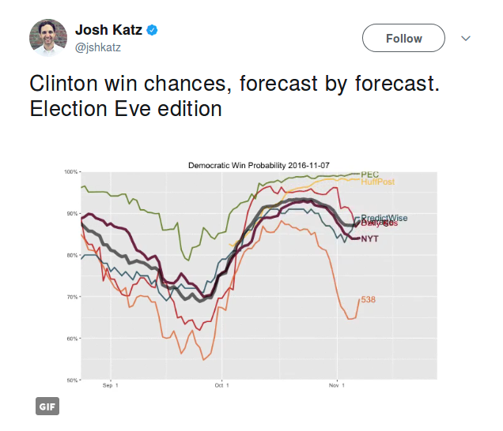
]

--

### O que deu errado?

--

### O que podemos aprender?


---

# Exemplo da Science

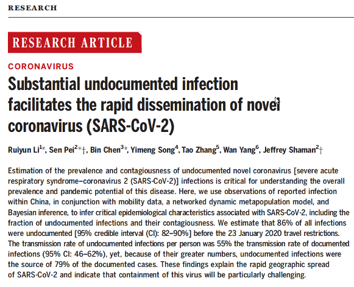

---

# Boas práticas

* Resultados reproduzíveis

  * Dados fornecidos
  * Rotinas computacionais fornecidas
  
* Análise de sensibilidade

  * Verificação se outras suposições chegariam a outros resultados
  * Checagem se condições iniciais afetam o sistema
  
* Os autores verificam a identificabilidade do modelo.

* Ressalvas sobre certas conclusões

  * Principalmente com relação a desfechos relativos a alterações bruscas devido a novas políticas.

* _Peer reviewed_

---

# Alguns resultados

* O artigo foi publicado online em meados de março.

--

* Os autores consideram os casos de SARS-Cov-2 na China:

  * modelam a natureza espaço temporal dos casos;
  * utilizam informações de deslocamento das pessoas dentre as diferentes cidades.

--
  
* Separam infecções em dois casos:

  * pessoas confirmadas com sintomas e a doença;
  * pessoas que nunca tiveram confirmação da doença.

--
  
* Modelam as trajetórias de suscetíveis, expostos, infectados documentados e não documentados.

  * Somente 14% dos casos foram identificados [10% - 18%].
  * Casos não identificados foram 55% tão contagiosos quanto aqueles identificados.


---

## Modelo para acompanhamento dos casos no Brasil

* Iniciativa do Depto. de Estatística da UFMG:

  * [https://dest-ufmg.shinyapps.io/app_COVID19/](https://dest-ufmg.shinyapps.io/app_COVID19/)

* Possível obter estimativas do Brasil e do mundo

* Os responsáveis pelo modelo disponibilizam todos as rotinas computacionais para replicar os resultados.

* Todas as suposições dos modelos são explicadas em seção a parte.


---
class: middle

# Estrutura do aplicativo

.center[
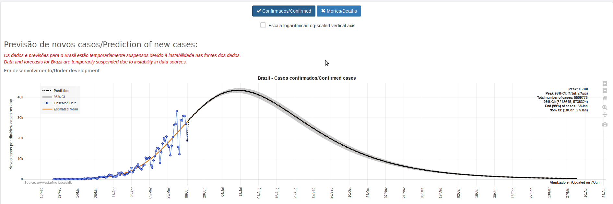
]

--

* O modelo é bastante volátil:

  * as previsões para possível pico da infecção e total de mortos varia bastante.
  
--

* Isso não é uma crítica ao modelo, mas sim uma observação sobre a dificuldade de modelar esses dados: 


---

# Dados sobre Covid-19 no ES

.center[
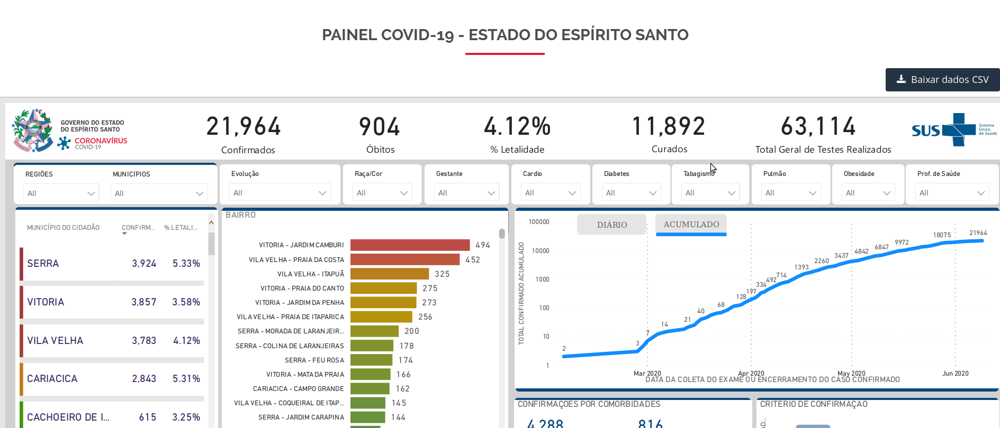
]

* É possível baixar os dados com informações sobre:

  * Sexo
  * Faixa de idade
  * Raça/Cor
  * Comorbidades


---

## Taxa de letalidade - entre pessoas negras e brancas 

.center[
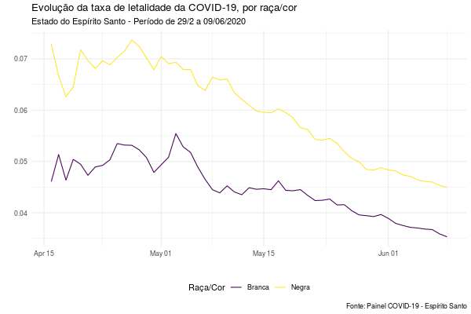
]

---

## Taxa de letalidade - entre pessoas negras e brancas 

#### por sexo

.center[
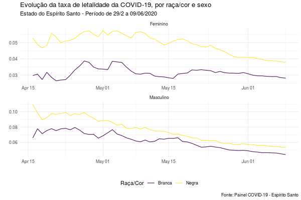
]

---

## Taxa de letalidade - entre pessoas negras e brancas 

#### por faixa etária

.center[
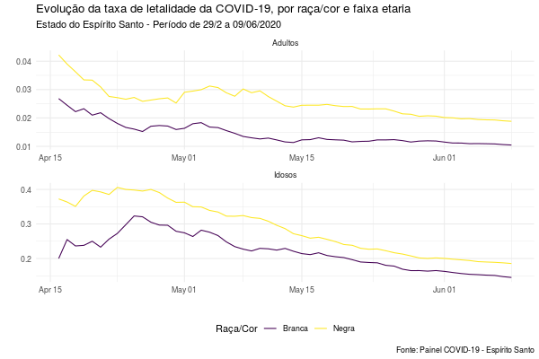
]


---

## Taxa de letalidade - entre pessoas negras e brancas 

#### por sexo e faixa etária

.center[
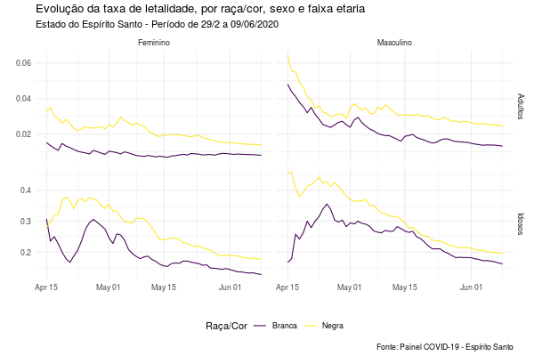
]

---
class: inverse, center, middle

# Conclusões

---
class: middle

# Conclusões

Com relação a modelos estatísticos:

* Transparência é essencial

* Cuidado com suposições do modelo

* Modelos são aproximações da realidade

* Importante checar a fonte dos resultados

* Importante mencionar a incerteza com relação aos resultados


---
class: inverse, center, middle

# O que mais pode ser aleatório?
 

---
class: center, middle

### https://www.data-imaginist.com/art

.pull-left[

```{r, out.width = 300, echo = FALSE}

```
]

.pull-right[
<br>
```{r, out.width = 350, echo = FALSE}
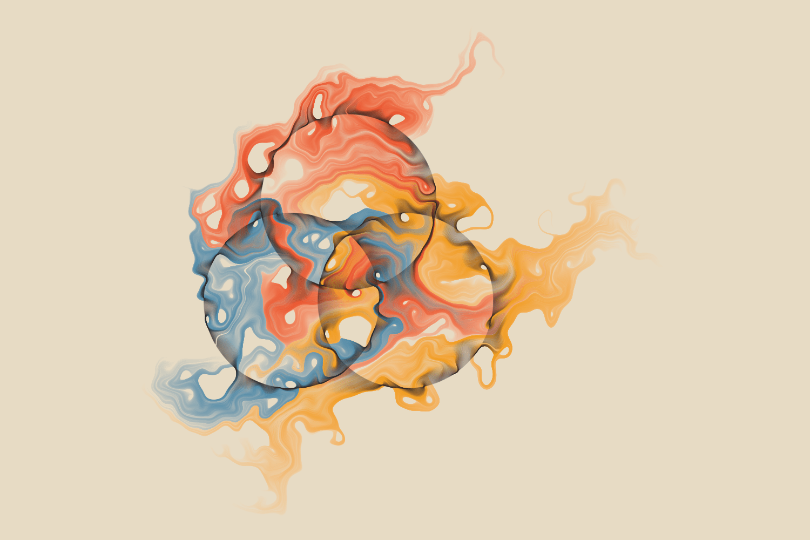
```
]


---
class: center, middle

# Obrigado!


Slides foram criados com pacote do R [**xaringan**](https://github.com/yihui/xaringan).

