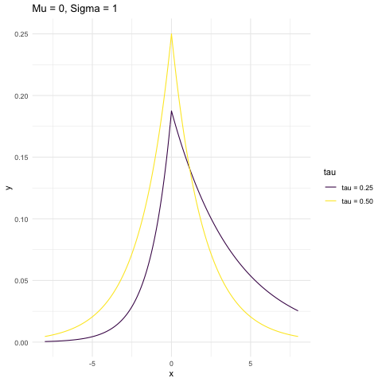
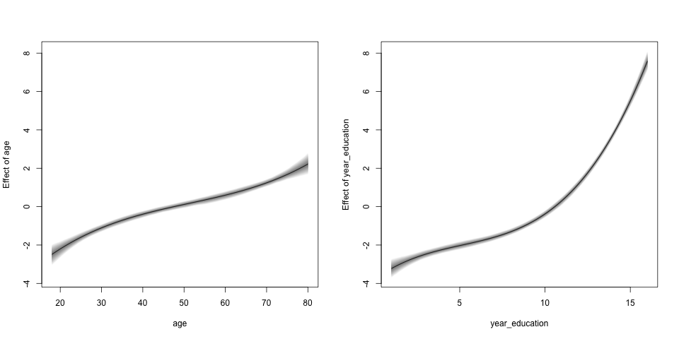

layout: true

background-image: url(ukent_logo.jpg)
background-position: 95% 5%
background-size: 20%

---
class: middle, center

# Advanced Regression Modelling

*****

### Bruno Santos


#### email: b.santos@kent.ac.uk


### GRC workshops

---

layout: false

```{r setup, include=FALSE}
options(htmltools.dir.version = FALSE)
library(dplyr)
library(ggplot2)
library(kableExtra)
library(patchwork)
library(glmnet)
library(dplyr)
library(ggplot2)
library(gganimate)
library(lubridate)
library(forcats)
library(leaflet)
library(rgdal)
knitr::opts_chunk$set(echo = TRUE, 
                      message = FALSE, 
                      warning = FALSE, 
                      fig.align = "center")
```

```{r xaringan-themer, include=FALSE, warning=FALSE}
library(xaringanthemer)
style_mono_accent(base_color = "#003882", 
                 header_font_google = google_font("Bebas Neue"),
                 text_font_google   = google_font("Montserrat", "300", "300i"),
                 code_font_google   = google_font("Fira Mono")
                 # header_font_google = google_font("Bebas Neue", "400", "400i")
                 )
```

```{r xaringan-scribble, echo=FALSE}
xaringanExtra::use_scribble()
xaringanExtra::use_share_again()
```

```{r xaringan-tachyons, echo=FALSE}
xaringanExtra::use_tachyons()
```

class: inverse, middle, center

# Introduction


---
# Regression models

- Statistical model to quantify association between two or more variables.

--

- Usually, we consider

  - "Regression to the mean" ou "Mean Regression"
  
--

- Even further

  - We assume linear effects.

--

- If we define

  - $Y$ as response variable,
  - $X$ as predictor variable,
  
--

$$\begin{align*}
E(Y|X = x) &= f(x) \\
&= \beta_0 + \beta_1 x
\end{align*}$$

---

# Visualisation - Positive effect

.center[

]


---
# Visualisation - Negative effect

.center[

]

---

# Conditional dist. - Positive effect

.center[
]


---

# Conditional dist. - Negative effect

.center[
]


---
# Summary

- Linear model

$$Y_i = \beta_0 + \beta_1 x_i + \epsilon_i, \quad i=1,\ldots,n.$$
--

- Assumption of the linear model:

  - Homoscedasticity : $\mbox{Var}(\epsilon_i) = \sigma^2$.
  
  - Independent errors.
  
  - $\epsilon_i \sim N(0, \sigma^2)$.
  
--

- It is possible to verify if these assumptions are met after we fit the model.

  - Diagnostic analysis.


---
# Data - Example

.center[

]

---
# Estimation methods

- Linear model

$$Y_i = \beta_0 + \beta_1 x_i + \epsilon_i$$
--

- Ordinary least squares
$$\min_{(\beta_0, \beta_1) \in \mathbb{R}^2} \sum_{i=1}^n (Y_i - \beta_0 - \beta_1 x_i)^2$$

--

- Linear model in its matricial form

$$Y = X\beta + \epsilon$$
--

- Least squares estimator 

$$\hat{\beta} = (X^t X)^{-1}X^t Y$$


---
# Regression example

.center[

]

---
# One vision about regression

.bg-washed-green.b--dark-green.ba.bw2.br3.shadow-5.ph4.mt5[
What the regression curve does is give a grand summary for the ave- rages of the distribution corresponding to the set of x’s. We could go further and compute several different regression curves correspon- ding to the various percentage points of the distribution and thus get a more complete picture of the set. Ordinarily this is not done, and so the regression often gives a rather incomplete picture. Just as the mean gives an incomplete picture of a single distribution, so the regression curve gives a correspondingly incomplete picture for a set of distributions.
.tr[
— Mosteller and Tukey (1977), pg. 266
]]

---
# Normal distribution and its quantiles

.pull-left[
]

--

.pull-right[
]


---
# Regression with conditional quantiles

.center[

]

---
class: inverse, bottom, left
background-image: url("img/gauss.jpg")
background-size: cover

### Gauss' grave

---
class: center, middle, inverse

# Quantile regression


---

# Initial thoughts

- The normal linear regression model is capable of estimating conditional quantiles.

--

  - But those quantiles will always be parallel.
  
--

- ### And when these quantiles are not parallel?

--

- That is the goal of quantile regression models.

--

- Estimate the effect of each predictor variable for different quantiles.

--

- This behavior violates the homoscedasticity assumption. 

--

  - There, the assumption for estimating this model will be different.
  
--

- Example:

  - Would the gender gap in salaries be different for lower or higher incomes?
  
---
# Visualising the difference - Normal linear model

.center[

]

---
# Example - Nature

.center[
]


---
# About estimation

- In the linear model,

$$Y_i = \beta_0 + \beta_1 x_i + \epsilon_i$$
--

- We considered minimise squared errors: 

$$\min_{(\beta_0, \beta_1) \in \mathbb{R}^2} \sum_{i=1}^n (Y_i - \beta_0 - \beta_1 x_i)^2$$

--

- Why not considering absolute errors?

$$\min_{(\beta_0, \beta_1) \in \mathbb{R}^2} \sum_{i=1}^n |Y_i - \beta_0 - \beta_1 x_i |$$
--

- Historically, the proposal to minimise absolute errors was the first idea for estimation.

--

  - But it was not possible to obtain an answer with the tools of the time.
  
---

# Quantile definition:

- Let $Y$ be a random variable with cumulative distribution function(cdf)
$$
 F(y) = P(Y \leqslant y).
$$

- Using the inverse function of the cdf at $\tau$, we define that

$$F^{-1}(\tau) = \mbox{inf}\{y: F(y) \geqslant \tau \}$$

is the quantile of order $\tau$ of random variable $Y$.


---
# Loss function 

- Remember the quadratic loss function $l(Y - \theta) = (Y - \theta)^2$.

--

  - We know this function is minimised when $\hat{\theta} = \bar{Y}$.
  
--

  - $\displaystyle \min_{\theta \in \Theta} E[(Y - \theta)^2]$.
  
--

- When we consider another loss function 
$$\rho_\tau (u) = u(\tau-\mathbb{I}(u<0)), \quad 0 < \tau < 1,$$
where $\mathbb{I}$ is the indicator function.

--

- Let $\hat{y}$, a predictor of $Y$, that minimises the loss function
$$E \big[ \rho_\tau(Y-\hat{y}) \big].$$
--

- We can verify that  $\hat{y}=F^{-1}(\tau)$ minimises that expected loss function.

---
# Seminal paper

.center[
]

---
# Main result

- Koenker and Bassett (1978):

  - Find the quantile regression estimator  $\boldsymbol \beta(\tau)$ as solution of the minimisation problem
  
$$\displaystyle \min_{\boldsymbol{\beta} \in \mathbb{R}^p} \sum_{i=1}^n \rho_\tau(y_i - \boldsymbol{x_i}'\boldsymbol{\beta}).$$
--

- This estimator is also known as weighted minimum absolute estimator.

--

- To find these minimum values of this function are found through linear programming algorithms.

  - Simplex algorithm;
  - Interior point algorithm.
  
--

- In `R` one can use the package: `quantreg`.

---
# Example - Coefficients plot

.center[]

---
# Example - Coefficients plot

.center[]

---
# Bayesian approach

- Notice that it was not necessary to assume a probability distribution for the response variable.

--

  - This is considered to be one of the advantages of the method. 
  
--

- For the Bayesian approach, remember that it is necessary a likelihood function.

--

- Bayes Theorem allows us to say

$$\pi(\beta|Y) \propto L(\beta) \pi(\beta)$$
--

- In the case of quantile regression model, we will consider the Asymmetric Laplace distribution. 

--

- $Y \sim LA(\mu, \sigma, \tau)$, with density function:

$$f(y;\mu,\sigma,\tau) = \frac{\tau(1-\tau)}{\sigma}\exp\left\{-\rho_\tau\left( \frac{y_i - \mu}{\sigma} \right)\right\}.$$
--

- Important property: $P(Y < \mu) = \tau$.


---
# Density examples


.pull-left[

]

--

.pull-right[
]

---
# Detail about the likelihood

--

.center[
]

---
class: inverse, middle, center

# Example with simulated data

---
# Beta distribution

- $Y \in [0, 1]$.

--

- $Y \sim Beta(a, b)$, where $a > 0$ and $b > 0$, if the density function is given by

$$f(y | a, b) = \frac{\Gamma(a+b)}{\Gamma(a)\Gamma(b)} y^{a-1}(1-y)^{b-1}.$$

--

<br>

- Properties

  - $E(Y) = a/(a+b)$
  - $Var(Y) = (a+b)/[(a+b)^2(a+b+1)]$
  
--

<br>

- Example:

  - Proportion of people with access to the internet.
  - Proportion of clients with debts in the bank.
  
---

# Density function example 

```{r graf15, out.width='60%', fig.asp=.75, fig.align='center', message=FALSE, echo=FALSE}
numero_pontos <- 100
list_parametros <- list(c(1, 1), 
                        c(4, 2), 
                        c(2, 4), 
                        c(4, 4), 
                        c(10, 10))

densidade_beta <- lapply(list_parametros, 
                       function(x) dbeta(0:numero_pontos/numero_pontos, 
                                         x[1], x[2])) %>%
  unlist()

dados_beta <- data.frame(x = rep(0:numero_pontos/numero_pontos, 
                                 length(list_parametros)),
                              densidade = densidade_beta, 
                              parametros = rep(as.character(list_parametros), 
                                          each = numero_pontos + 1))


ggplot(dados_beta, aes(x = x, y = densidade, color = parametros)) +
  theme_minimal() + 
  geom_line() + 
  scale_color_discrete(name = "(a, b)")
```

---
# Density reparameterisation

- We can reparameterise the distribution's density:

  - **Goal:** The parameters have a more meaningful explanation:

$$f(y_i; \mu_i, \phi) = \frac{\Gamma(\phi)}{\Gamma(\mu_i \phi)\Gamma((1-\mu_i)\phi)} y^{\mu_i \phi-1}(1-y)^{(1-\mu_i)\phi-1}, \quad 0 < y_i < 1,$$
- $E(Y) = \mu$, $0 < \mu < 1.$
- $\mbox{Var}(Y) = (\mu(1-\mu))/(1+\phi)$, $\phi > 0.$

--

- We can also write the parameters as function of other variables. 

--

- Obtaining a beta regression model

  - $g(\mu_i) = x_i^t\beta$
  

---
# Beta distribution mixture

- Consider that we generate values of the distribution $X \sim Unif(0, 1)$.

--

- Simulate 600 observations of the Beta distribution with $\phi = 100$ and considering two values for $\mu_i$ with equal probability

$$\mu_1 = \frac{\exp(-1-x_i)}{1 + \exp(-1-x_i)},$$ 
$$\mu_2 = \frac{\exp(1+x_i)}{1 + \exp(1+x_i)}.$$
--

- This will generate a mixture of Beta distributions

  - With the same precision parameter.
  
  - Though, different means.
  
---
# Data histogram

.center[
]

---
# Dispersion values

.center[
]

---
class: middle

# Estimated coefficients by quantile regression

.right-column[
]

.left-column[
<br><br><br>

- Coefficients are equal to 1 to larger quantiles.

- And equal to -1 for smaller quantiles.

- Without the need to define a beta distribution for the response variable.
]

---
class: inverse, bottom, left
background-image: url("img/canterbury1.jpg")
background-size: cover

### Canterbury

---
class: middle, center, inverse

# Example with real data


---
# Data about income in a state of Brazil

- Data from 2015.

- Filtering people from the state of Paraiba.

- With age > 18 years old.

- With income larger than zero.

--

- Total: 2.544 people.

  - **Response variable**: people income

---
# Income histogram as a function of other variables 

.pull-left[
]

--

.pull-right[
]

---
# Dispersion plot as function of other variables

.pull-left[
]

--

.pull-right[
]

---
# Quantile regression model

- Let's consider the following model:

--

- **Response variable:** 

  - Income.
  
--

- **Predictor variables:**

  - age
  - gender (Female, Male)
  - race (White, Non-white)
  - years of education
  
---
# Model estimates

.center[

]

---

# Model estimates - Years of education

.center[

]


---

# Model estimates - White people

.center[

]

---

# Model estimates - Male gender

.center[

]

---

# Model estimates - Age

.center[

]

---
# Final remarks

- Quantile regression allows to estimate regression effects in a local way.

--

- It is not necessary to assume a probability distribution for the data.

--

  - See example with mixture of data with beta distribution.
  
--

- Quantile regresion model allows to obtain conclusions such as:
  - one variable has an effect different than zero for just a region of the response variable. 

--

- It is possible to use the Bayesian approach or the classical one as well.

---
class: inverse, bottom, left
background-image: url("img/coffee_pexel.jpg")
background-size: cover

### Questions

---
class: inverse, middle, center

# Other regression models

---
# Regression models

- Initially, we talked about regression models for the mean.
  
  - The mean is written as function of other covariates.
  
--

- The normal model is the main example of this class of models.

--

  - But we can cite generalized linear models (GLM).
  
--

- Following, we presented quantile regression models.

--

  - More flexible, as they are capable of estimating effects in different quantiles.
  
--

- But there are other ways of suggesting more flexible models.

---

# Distributional regression

- We can consider that all available parameters of a probability distribution can be written with regression elements.

--

  - What does that mean?
  
--

- Consider the case where $Y \sim Beta(\mu, \phi)$.

  - We can write a model for the mean
  
--

$$g(\mu) = x^t \beta$$
--

  - But we could also write a model for the precision parameter.
  
--

$$h(\phi) = z^t \gamma$$
--

- The predictor variables can be the same or we can consider different sets of variables.

--

- Some of these models that suggest this alternative are known as *distributional regression*.

  - GAMLSS or BAMLSS.

---
# BAMLSS

- *Bayesian additive models for location, scale and shape.* 

  - *A Lego Toolbox for Flexible Bayesian Regression (and Beyond)*

- You can find a good introduction to these models in

  - [http://www.bamlss.org](http://www.bamlss.org)

--

- These models are equivalent to GAMLS models, but with a Bayesian approach.
--

- The idea is that if

$$Y \sim \mathcal{D}(h_1(\theta_1), \ldots, h_k(\theta_k))$$
--

- Then, it is possible use these models with 

$$\eta_i = \eta(X, \beta_i) = f_{1j}(X;\beta_{1j}) + \cdots + f_{mj}(X;\beta_{mj})$$
--

- Where these functions can be represented as nonlinear functions, spatial effects, etc.

---
# Example

- Let's consider the same data considered before about income.

--

- We can consider the Gamma distribution to model this data set.

--

- The density of the gamma distribution is given by

$$f(y; \mu, \sigma) = \frac{y^{\sigma-1}\exp\left\{-\frac{\sigma y}{\mu}\right\}}{\left(\frac{\mu}{\sigma}\right)^\sigma \Gamma(\sigma)}$$

--

- In, we can do the following: 

```{r, echo = FALSE}
data_pnad <- read.csv('dadosResumo_PNAD2015.csv', 
                       head = TRUE)

data_paraiba <- data_pnad %>% 
  filter(UF == 25) %>% 
  filter(CondicaoAtividade == 1) %>% 
  filter(Idade > 18) %>% 
  mutate(income = ifelse(RendimentoTotal >= 9e11, NA, RendimentoTotal)) %>% 
  filter(!is.na(income)) %>% 
  filter(income > 0) %>% 
  mutate(race = ifelse(Etnia == 2, "White", "Non-white")) %>% 
  mutate(gender = ifelse(Sexo == 2, "Male", "Female")) %>% 
  rename(age = Idade, 
         year_education = AnosEstudo) 
```


```{r, results='hide'}
library(bamlss)

f <- income ~ gender + race + age + year_education

b1 <- bamlss(f, family = "gamma", data = data_paraiba)
```

--

- Initially, we are modelling only the mean of $Y$.

---
# First results

- To obtain the estimates and respective credible intervals, we can do

```{r, eval = FALSE}
summary_model <- summary(b1)
```

--

- One part of this result can be seen in the following table, with the coefficients for the mean


--

- All variables seem to contribute to explain the mean of the income variable.

---
# Nonlinear effects

- Should we consider only linear effects for variables age and years of education? 

--

- We can check this hypothesis testing the possibility of a nonlinear effect for each one of these variables.

--

- We could start by testing a polinomial effect for each one of those.

- With BAMLSS, we can do that altering our formula:

```{r, results='hide'}
f2 <- income ~ gender + race + poly(age, 3) + poly(year_education, 3)

b2 <- bamlss(f2, family = "gamma", data = data_paraiba)
```

- We can compare both models, through DIC.

```{r}
DIC(b1, b2)
```

---
# Visualising nonlinear effects

- We can do the following in R to visualise nonlinear effects:

```{r, eval = FALSE}
nd <- data.frame(year_education = seq(1, 16, len = 100), 
                 age = seq(18, 80, len = 100))

nd$p_age <- predict(b2, newdata = nd, 
                     model = "mu", term = "age",
        FUN = c95, intercept = FALSE)

nd$p_years_educ <- predict(b2, newdata = nd, 
                     model = "mu", term = "year_education",
                     FUN = c95, intercept = FALSE)

par(mfrow = c(1, 2))
ylim <- range(c(nd$p_age, nd$p_years_educ))
plot2d(p_age ~ age, data = nd, ylim = ylim)
plot2d(p_years_educ ~ year_education, 
       data = nd, ylim = ylim)
```

---
# Result

.center[
]

---
class: inverse, bottom, left
background-image: url("img/dirichlet.jpg")
background-size: cover

### Dirichlet's grave

---
# Other probability distributions 

- Here, we consider the Gamma distribution, but we could have considered others.

--

  - In fact, we did not do any kind of diagnostic analysis.
  
--

- Before doing this, we will propose models with other probability distributions.

  - And make that comparison.
  
--

- We can try the following probability distributions.

  - Weibull distribution.
  - Lognormal distribution.
  - Generalised Pareto distribution.
  
- If you're interested to see all densities available, you can check the following link:

  - [http://www.bamlss.org/articles/families.html](http://www.bamlss.org/articles/families.html)

---
# Fitting other models:

```{r, results='hide'}
b2_1 <- bamlss(f2, family = "gamma", data = data_paraiba)

b2_2 <- bamlss(f2, family = "weibull", data = data_paraiba)

b2_3 <- bamlss(f2, family = "lognormal", data = data_paraiba)

b2_4 <- bamlss(f2, family = "gpareto", data = data_paraiba)
```

--

- We can compare DIC's of the models

--

```{r}
DIC(b2_1, b2_2, b2_3, b2_4)
```


---
# Diagnostic analysis

- The most used residual for this type of model is the quantile residual. 

  - In summary, you expect that this residual follows a normal distribution, if the model is well fitted.
  
--

- We can use the following commands in R, to evaluate the fit:

```{r, eval = FALSE}
plot(b2_1, which = c("hist-resid", "qq-resid"))

plot(b2_2, which = c("hist-resid", "qq-resid"))

plot(b2_3, which = c("hist-resid", "qq-resid"))

plot(b2_4, which = c("hist-resid", "qq-resid"))
```

---
# Diagnostic analysis - Gamma model


---
# Diagnostic analysis - Weibull model


---
# Diagnostic analysis - Lognormal model


---
# Diagnostic analysis -  Generalised Pareto model


---
# Now the parameter $\sigma$

- In the gamma distribution, we had

$$f(y; \mu, \sigma) = \frac{y^{\sigma-1}\exp\left\{-\frac{\sigma y}{\mu}\right\}}{\left(\frac{\mu}{\sigma}\right)^\sigma \Gamma(\sigma)}$$
--

- We fitted a model for the mean $\mu$.

  - But we can check whether we gain more information using a regression element to parameter $\sigma$.
  
--

- Basically, we assume a regression structure for $\sigma.$

$$h(\sigma) = f(X; \gamma)$$
  
```{r, eval = FALSE}
f3 <- list(income ~ gender + race + poly(age, 3) + poly(year_education, 3), 
           sigma ~ gender + race + poly(age, 3) + poly(year_education, 3))

b3 <- bamlss(f3, family = "gamma", data = data_paraiba)
```

---

# Coefficients for $\mu$ 

.center[]


---

# Coefficients for $\sigma$

.center[]

---
# Visualisation of nonlinear effects

- We can use the same commands as before, just altering `model = "sigma"`

```{r, eval = FALSE}
nd <- data.frame(year_education = seq(1, 16, len = 100), 
                 age = seq(18, 80, len = 100))

nd$p_age <- predict(b2, newdata = nd, 
                     model = "sigma", term = "age",
        FUN = c95, intercept = FALSE)

nd$p_year_educ <- predict(b2, newdata = nd, 
                     model = "sigma", term = "year_education",
                     FUN = c95, intercept = FALSE)

par(mfrow = c(1, 2))
ylim <- range(c(nd$p_age, nd$p_year_educ))
plot2d(p_age ~ age, data = nd, ylim = ylim)
plot2d(p_year_educ ~ year_education, data = nd, ylim = ylim)
```

---
# Resultado

.center[]


---
# Increasing the flexibility of the nonlinear effect

- Instead of using a polinomial model, we can use a more flexible approach.

--

- For instance, using some form of splines. 

--

  - The BAMLS package has some predefined functions.
  
--

- To fit the model like that, we can do

```{r, eval = FALSE}
f4 <- list(income ~ gender + race + age + s(year_education), 
           sigma ~ gender + race + s(age) + s(year_education))

b4 <- bamlss(f4, family = "gamma", data = data_paraiba)
```

---
# Visualisation of the nonlinear effect

.center[]

---
class: inverse, bottom, left
background-image: url("img/canterbury2.jpg")
background-size: cover

### Canterbury

---
# Interpreting the parameters in these models

- We can use a R package to help us to observe the results of the models.

--

- One package that does that is the `distreg.vis`.

  - More info at [https://github.com/Stan125/distreg.vis](https://github.com/Stan125/distreg.vis).
  
--

- One can generate different scenarios for the explanatory variables and observe the associated probability distribution.

--

- After fitting the models, we can do the following the compare the different scenarios:

```{r, eval = FALSE}
distreg.vis::vis()
```

--

- This command will initiate a Shiny app to visualise the different results of the models.

---
# App illustration

- One example that we can obtain with this package.

.center[]

---
# App illustration

- We can also compare the values of the moments of the chosen scenarios.

.center[]

---
class: inverse, middle, center

# Spatial effects

---
# Intuition

- There are different ways of you estimating spacial effects inside a statistical model.

--

- One of these ways is thinking about splines in two dimensions. 
--

  - Now, we can obtain a nonlinear surface. 
  
--

- The BAMLSS package also enables the user with different ways of estimating this spacial effect.

--

- We can see some examples in the following figures.

---
# Example with data about rain in Austria.

- Taken from the paper:

  - Umlauf, Klein and Zeileis (2018). “BAMLSS: Bayesian Additive Models for Location, Scale and Shape (and Beyond).” *Journal of Computational and Graphical Statistics* 27 (3): 612–27.
  
.center[]


---
# Results of the model

.center[]

---
# Results of the model

.pull-left[]

.pull-right[]

<!-- --- -->
<!-- class: inverse, middle, center -->

<!-- # Modelos de regressão quantílica para variáveis aleatórias com mais de uma dimensão -->

<!-- --- -->
<!-- # Variável resposta com mais de uma dimensão -->

<!-- .pull-left[ -->
<!-- Escore no ENEM: -->
<!-- - $Y_1$: ciências humanas -->
<!-- - $Y_2$: ciências biológicas -->
<!-- - $Y_3$: matemática  -->

<!-- Nota-se uma relação de dependência entre as variáveis. -->

<!-- ] -->

<!-- .pull-right[ -->
<!-- ] -->

<!-- --- -->
<!-- # Direções -->

<!-- .center[] -->

<!-- - Nesse modelo, foram estimados modelos em 512 direções: -->

<!--   - Para entender como diferentes variáveis podem ter um efeito na nota das pessoas fazendo o ENEM. -->

<!-- - Variáveis consideradas: -->

<!--   - Gênero, escola pública vs privada, educação dos pais, etc. -->

<!-- --- -->
<!-- # Diferença entre escola pública e privada -->

<!-- .center[] -->

<!-- --- -->

<!-- class: middle, center, inverse -->

<!-- # Modelos de regressão quantílica com dados de sobrevivência -->

<!-- --- -->
<!-- # Exemplo: -->

<!-- - Artigo: Rodrigues, Borges e Santos (2021). A defective cure rate quantile regression model for male breast cancer data.  -->

<!-- .center[] -->


---
class: middle, center


# Thank you!
 
**b.santos@kent.ac.uk**

**Twitter:** @bruno_r_santos


